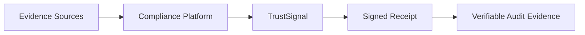

# TrustSignal

[](https://github.com/trustsignal-dev/trustsignal/actions/workflows/ci.yml)
[](LICENSE)
[](https://www.typescriptlang.org/)
[](vitest.config.ts)
[](SECURITY_CHECKLIST.md)
[](security/threat_model.md)
[](security/audit_report.md)

Website: https://trustsignal.dev

TrustSignal provides signed receipts and verifiable provenance for compliance artifacts.

TrustSignal is an integrity layer, not a workflow replacement. It fits into existing compliance workflows without replacing the upstream system of record.

## Why TrustSignal Exists

Many teams can show that a file was uploaded, reviewed, or approved. Fewer can later prove that the artifact under review is unchanged from the one originally collected.

TrustSignal addresses that gap by issuing signed receipts and retaining verification state that make later drift detectable and auditable. The product is designed to sit behind an existing intake, evidence, or compliance platform, so the workflow owner keeps control of collection while TrustSignal supplies integrity evidence.

## Evidence Integrity Architecture



## Key Capabilities

- signed receipt issuance and later receipt verification
- tamper-evident digest comparison and receipt reconstruction
- receipt lifecycle operations for retrieval, revocation, status, and anchoring
- versioned API surfaces for workflow integrations and partner-facing evidence payloads
- registry screening and normalized evidence outcomes for configured sources
- scoped authentication, request validation, rate limiting, and structured logging

DeedShield is the current application surface in this repository. The broader product framing is evidence integrity infrastructure for compliance artifacts.

## Example Use Cases

- issuing signed receipts for compliance artifacts at the point of collection
- re-verifying stored evidence before audit, review, or partner submission
- attaching verifiable provenance to partner-facing evidence payloads
- adding integrity checks to deed and property-record verification workflows without replacing the originating platform

## Quickstart / 5-Minute Demo

The lowest-risk local path is to run the API and web workspaces and try the product through the existing application surface.

Prerequisites:

- Node.js `>= 18`
- npm `>= 9`
- PostgreSQL `>= 14` for `apps/api`

Quickstart:

```bash
npm install
cp .env.example .env.local
cp apps/api/.env.example apps/api/.env
npm -w apps/api run db:generate
npm -w apps/api run db:push
npm -w apps/api run dev
```

Before running `db:push`, set at minimum a valid `DATABASE_URL` in `apps/api/.env`. The API template also includes scoped API-key settings and provider variables for the integration paths you want to exercise.

In a second terminal:

```bash
npm -w apps/web run dev
```

Default local ports:

- web app: `http://localhost:3000`
- API: `http://localhost:3001`

What this local path proves:

- TrustSignal fits behind an existing workflow rather than replacing it
- verification requests produce signed receipts and stored verification state
- receipts can be retrieved and re-verified through the API surface

For fuller local setup details, including PostgreSQL configuration and workspace-specific environment guidance, see `apps/api/SETUP.md`. For partnership demo materials, see `docs/partnership/vanta-2026-03-06/README.md`.

## API Overview

TrustSignal exposes two main API surfaces in this repository.

Core TrustSignal `/v1/*` routes use JWT authentication:

- `POST /v1/verify-bundle`
- `POST /v1/revoke`
- `GET /v1/status/:bundleId`

Integration-oriented `/api/v1/*` routes use scoped `x-api-key` access:

- service and status: `GET /api/v1/health`, `GET /api/v1/status`, `GET /api/v1/metrics`
- verification: `POST /api/v1/verify`, `POST /api/v1/verify/attom`, `GET /api/v1/synthetic`
- receipt lifecycle: `GET /api/v1/receipt/:receiptId`, `GET /api/v1/receipt/:receiptId/pdf`, `POST /api/v1/receipt/:receiptId/verify`, `POST /api/v1/receipt/:receiptId/revoke`, `POST /api/v1/anchor/:receiptId`, `GET /api/v1/receipts`
- partner integrations: `GET /api/v1/integrations/vanta/schema`, `GET /api/v1/integrations/vanta/verification/:receiptId`
- registry services: `GET /api/v1/registry/sources`, `POST /api/v1/registry/verify`, `POST /api/v1/registry/verify-batch`, `GET /api/v1/registry/jobs`, `GET /api/v1/registry/jobs/:jobId`

`POST /api/v1/receipt/:receiptId/revoke` also expects signed issuer headers: `x-issuer-id`, `x-signature-timestamp`, and `x-issuer-signature`.

The integration model is intentionally narrow: upstream platforms retain workflow ownership, while TrustSignal provides receipt, verification, status, and evidence services at the boundary.

## Security Posture

This repository is operated with a security-first posture and explicit claim boundaries.

Implemented controls include:

- API authentication for both JWT (`/v1/*`) and scoped API-key (`/api/v1/*`) surfaces
- signed receipts returned with verification results
- receipt lifecycle validation for retrieval, verification, status, and revocation state
- revocation controls with issuer authorization requirements
- rate limiting and abuse protection controls
- fail-closed dependency handling on critical verification and startup guardrail paths
- input validation at API boundaries and structured log redaction for selected sensitive fields
- database TLS enforcement checks for production API startup
- primary-source registry guardrails with explicit compliance-gap outcomes

Environment and auth requirements are real and enforced. Important variables include:

- `API_KEYS` and `API_KEY_SCOPES`
- `TRUSTSIGNAL_JWT_SECRETS` or `TRUSTSIGNAL_JWT_SECRET`
- `TRUSTSIGNAL_RECEIPT_SIGNING_PRIVATE_JWK`
- `TRUSTSIGNAL_RECEIPT_SIGNING_PUBLIC_JWK`
- `TRUSTSIGNAL_RECEIPT_SIGNING_KID`
- optional `TRUSTSIGNAL_RECEIPT_SIGNING_PUBLIC_JWKS`
- `DATABASE_URL`
- `NOTARY_API_KEY`, `PROPERTY_API_KEY`, and `TRUST_REGISTRY_SOURCE` for production verifier configuration
- `TRUSTSIGNAL_ZKP_BACKEND`, `TRUSTSIGNAL_ZKP_PROVER_BIN`, and `TRUSTSIGNAL_ZKP_VERIFIER_BIN` when using external proof infrastructure

Never commit real secrets, API keys, private keys, or local env files. Infrastructure claims such as encrypted-at-rest storage, TLS termination, and key custody require environment-specific evidence outside this repo.

See `SECURITY_CHECKLIST.md`, `security/audit_report.md`, and `security/threat_model.md` for current evidence and open gaps.

## Repository Structure

- `apps/api/`: DeedShield API and integration-facing routes
- `apps/web/`: DeedShield web app
- `src/`: TrustSignal runtime and `/v1/*` API surface
- `packages/core/`: shared receipt, integrity, and verification logic
- `packages/contracts/`: anchoring contract code and related tooling
- `sdk/`: JavaScript SDK for TrustSignal APIs
- `docs/`: canonical product, architecture, operations, and partnership documentation
- `security/`: audit and threat-model artifacts
- `tests/`: API, integration, middleware, and end-to-end coverage
- `circuits/` and `ml/`: supporting implementation and R&D artifacts, not the primary product interface

## Development Workflow

Primary validation commands:

```bash
npm run lint
npm run typecheck
npm test
```

Full validation:

```bash
npm run validate
```

Signed-receipt smoke validation:

```bash
npm run smoke:signed-receipt
```

Development notes:

- `apps/api/.env.example` is the main local template for API work
- `.env.example` at the repo root supports repo-level scripts and local placeholders
- contract-focused work in `packages/contracts` currently uses Hardhat 3 tooling and should be validated on Node 22+
- when behavior or posture changes, update the relevant docs and checklists in the same change

## Documentation

Start with:

- `docs/README.md`
- `docs/CANONICAL_MESSAGING.md`
- `PROJECT_PLAN.md`
- `SECURITY_CHECKLIST.md`
- `apps/api/SETUP.md`
- `sdk/README.md`
- `TASKS.md`
- `CHANGELOG.md`

Canonical architecture, API, and operations guidance also lives under `docs/final/`, including:

- `docs/final/02_ARCHITECTURE_AND_BOUNDARIES.md`
- `docs/final/03_SECURITY_AND_COMPLIANCE_BASELINE.md`
- `docs/final/05_API_AND_INTEGRATION_GUIDE.md`
- `docs/final/06_PILOT_AND_MARKETPLACE_READINESS.md`
- `docs/final/14_VANTA_INTEGRATION_USE_CASE.md`

## Claims / Compliance Boundaries

TrustSignal provides technical verification signals, not legal determinations.

TrustSignal should not currently be described as:

- a replacement for compliance, audit, or workflow systems
- a finished production-grade document-authenticity proof platform across all surfaces
- a completed compliance certification or a substitute for independent control validation
- a system that should log, expose, or anchor raw PII without explicit need and supporting controls

Public messaging must not imply:

- completed production readiness without infrastructure evidence
- final cryptographic or proof guarantees where the implementation is still partial or environment-gated
- compliance certifications that are not independently validated

This repository includes roadmap and supporting implementation material. Those elements must remain clearly separated from current implemented behavior in any public-facing material.
