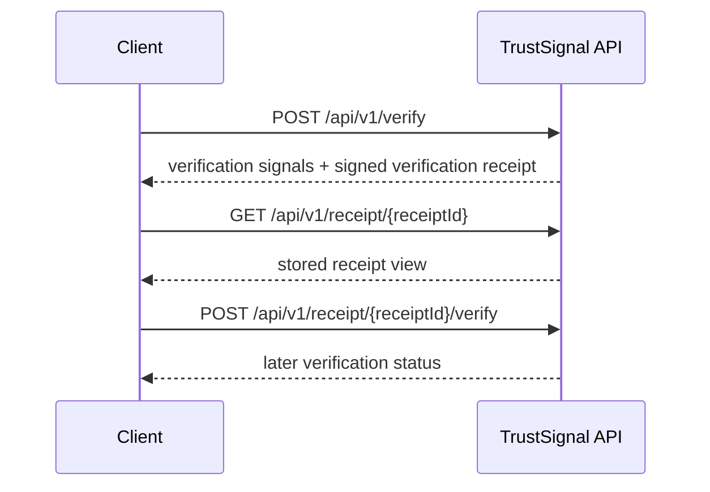

# TrustSignal Evaluator Quickstart

## Problem

A partner engineer evaluating TrustSignal needs a fast path to see what goes in, what comes back, and how later verification works. The relevant attack surface is not only bad input at intake, but also tampered evidence, provenance loss, artifact substitution, and stale evidence that becomes hard to defend later.

## Integrity Model

TrustSignal is evidence integrity infrastructure. It acts as an integrity layer for existing workflows by accepting a verification request, returning verification signals, issuing signed verification receipts, and exposing verifiable provenance metadata for later verification.

## Evaluator Path

Start with these evaluator assets:

- [OpenAPI contract](/Users/christopher/Projects/trustsignal/openapi.yaml)
- [API playground](/Users/christopher/Projects/trustsignal/docs/partner-eval/api-playground.md)
- [Postman collection](/Users/christopher/Projects/trustsignal/postman/TrustSignal.postman_collection.json)
- [Postman local environment](/Users/christopher/Projects/trustsignal/postman/TrustSignal.local.postman_environment.json)

The 5-minute evaluator path uses the public `/api/v1/*` lifecycle already documented in this repository:



Use this path when you want to confirm that TrustSignal can fit behind an existing workflow and produce an audit-ready verification artifact before production integration work begins.

## Integration Fit

The evaluator path is a deliberate evaluator path. It shows the verification lifecycle safely before production authentication, signing, and environment requirements are fully configured.

## Production Deployment Requirements

Local development defaults are intentionally constrained and fail closed where production trust assumptions are not satisfied. Production deployment requires explicit authentication, signing configuration, and environment setup.

## Technical Detail

### Step 1: Submit An Artifact Hash And Verification Request

Request body: [verification-request.json](/Users/christopher/Projects/trustsignal/examples/verification-request.json)

```bash
curl -X POST "$TRUSTSIGNAL_BASE_URL/api/v1/verify" \
  -H "Content-Type: application/json" \
  -H "x-api-key: $TRUSTSIGNAL_API_KEY" \
  --data @examples/verification-request.json
```

Expected response shape: [verification-response.json](/Users/christopher/Projects/trustsignal/examples/verification-response.json)

Key public-safe outputs to look for:

- `decision` as the current verification signal
- `receiptId` as the stable handle for later retrieval
- `receiptSignature` as the signed verification receipt artifact
- `anchor.subjectDigest` as verifiable provenance metadata when available
- `revocation.status` as current lifecycle state

### Step 2: Retrieve The Stored Receipt

```bash
curl "$TRUSTSIGNAL_BASE_URL/api/v1/receipt/$RECEIPT_ID" \
  -H "x-api-key: $TRUSTSIGNAL_API_KEY"
```

Expected response shape: [verification-receipt.json](/Users/christopher/Projects/trustsignal/examples/verification-receipt.json)

This response shows the stored receipt view, the canonical receipt payload, and the PDF URL used for evaluator review.

### Step 3: Run Later Verification

```bash
curl -X POST "$TRUSTSIGNAL_BASE_URL/api/v1/receipt/$RECEIPT_ID/verify" \
  -H "x-api-key: $TRUSTSIGNAL_API_KEY"
```

Expected response shape: [verification-status.json](/Users/christopher/Projects/trustsignal/examples/verification-status.json)

This later verification step is how a workflow or reviewer confirms that the stored receipt still verifies before audit, handoff, or downstream reliance.

### Step 4: Review Optional Lifecycle Actions

If your evaluation includes lifecycle controls that are already public in the contract:

- `POST /api/v1/receipt/{receiptId}/revoke` returns authorized revocation state
- `POST /api/v1/anchor/{receiptId}` returns provenance-state metadata when enabled

These operations are part of the public lifecycle, but they are not required to validate the core evaluator path.

## What This Evaluator Path Demonstrates

- TrustSignal can fit behind an existing workflow without replacing the system of record
- the API returns verification signals and signed verification receipts in one flow
- stored receipts can be retrieved later
- later verification is a distinct lifecycle step
- verifiable provenance metadata is available through the public contract where supported
- the system is built for workflows where tampered evidence and provenance loss matter after collection

## Claims Boundary

This evaluator path demonstrates a technical verification lifecycle. It does not demonstrate legal determinations, compliance certification, fraud adjudication, or system-of-record replacement.
