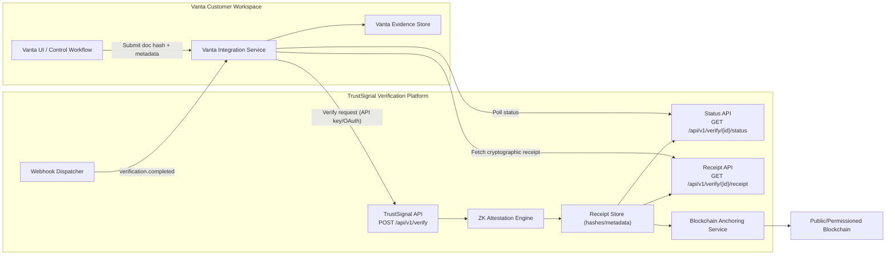
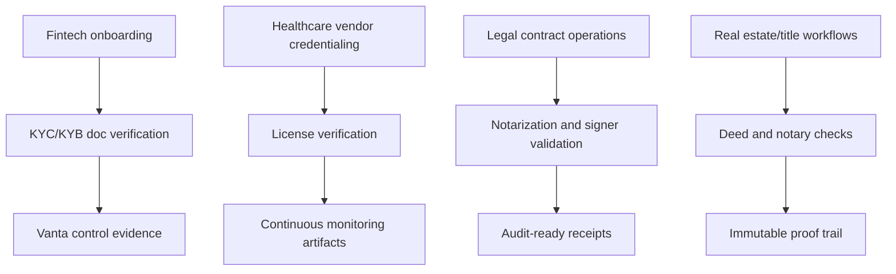

# Integration Architecture: TrustSignal x Vanta

## 1) System Architecture

## 2) Data Flow and Boundaries

1. Vanta-side workflow sends a verification request with commitment/hash and contextual metadata.
2. TrustSignal verifies and returns a `verificationId` immediately.
3. TrustSignal computes decision, risk signals, and ZK attestation metadata.
4. TrustSignal stores receipt hash and evidence metadata (no raw document persistence in receipt store).
5. TrustSignal optionally anchors receipt hash on-chain and exposes immutable reference.
6. Vanta retrieves status/receipt or receives webhook, then writes result into compliance evidence trail.

## 3) Zero-Knowledge Value Proposition

- Vanta does not need to store or process raw customer documents in the integration contract.
- TrustSignal returns authenticity proof artifacts (`receiptHash`, attestation metadata, checks, decision, anchor refs).
- Audit evidence is portable and tamper-evident through signed receipts and optional chain anchoring.

## 4) SOC 2 / Compliance Control Mapping (Partnership Narrative)

- CC6/CC7 (logical access and monitoring): API auth scopes, rate limits, and request logging.
- CC8 (change management): versioned API schema + deterministic receipt model.
- CC9 (risk mitigation): standardized verification checks and consistent decision outputs.
- Audit readiness: immutable receipt hash + timestamped decision trail.

## 5) Joint Use Case Diagram

