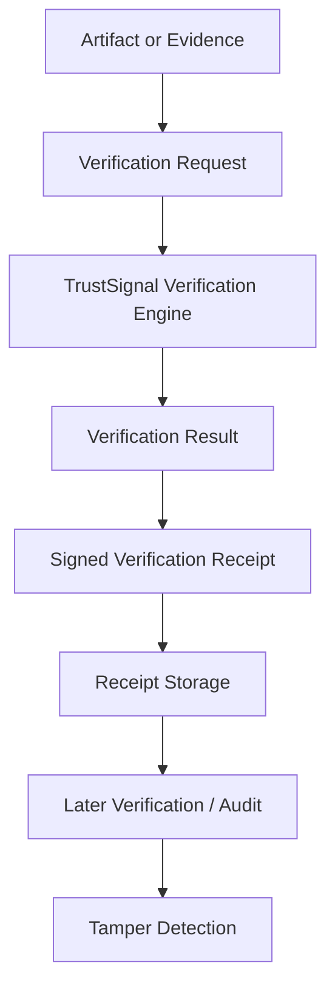
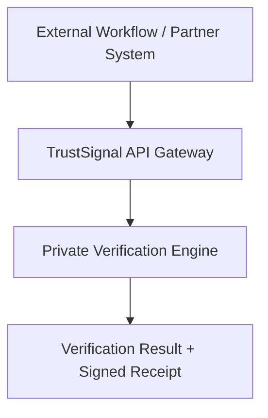

# TrustSignal Verification Lifecycle

> TrustSignal is evidence integrity infrastructure for signed verification receipts and later verification.

Short description:
This document explains the externally visible TrustSignal verification lifecycle for verification signals, signed verification receipts, verifiable provenance, and later verification in existing workflow integration.

Audience:
- evaluators
- developers
- security reviewers

TrustSignal is evidence integrity infrastructure for existing workflows. The verification lifecycle below shows the externally visible flow for producing verification signals, issuing signed verification receipts, and supporting later verification without exposing private verification engine internals.

## Problem / Context

Partner workflows often need to rely on evidence after collection, not just at intake. The lifecycle matters because later verification is where tampered evidence, provenance loss, artifact substitution, and stale records become visible.

## Integrity Model

TrustSignal acts as an integrity layer around an existing system of record. It returns:

- signed verification receipts
- verification signals
- verifiable provenance
- later verification capability

## Example Or Diagram

### Lifecycle Diagram

## How It Works

### Step Explanations

### 1. Artifact or Evidence

An external workflow collects or references an artifact that needs integrity-aware verification. This can be a document, evidence packet, or another workflow artifact that may be challenged later.

### 2. Verification Request

The workflow submits a verification request through the TrustSignal API boundary. The request binds the artifact context and provenance fields that downstream teams may need during later review.

### 3. TrustSignal Verification Engine

TrustSignal evaluates the request within the private verification environment. Public documentation does not expose internal proof systems, signing infrastructure, or service topology.

### 4. Verification Result

The engine returns verification signals that describe the outcome of the verification request. These signals are meant for downstream workflow logic, storage, and review.

### 5. Signed Verification Receipt

TrustSignal issues a signed verification receipt that captures the verification outcome and verifiable provenance for later verification.

### 6. Receipt Storage

The external workflow stores the receipt alongside its own record. TrustSignal does not replace the system of record; it adds integrity-layer outputs that the system of record can retain.

### 7. Later Verification / Audit

Before relying on the earlier result during audit review, partner review, or another high-loss workflow step, the workflow can request later verification against the stored receipt state.

### 8. Tamper Detection

If the current artifact or stored state no longer matches the receipt-bound record, later verification produces a mismatch signal that exposes tampering, substitution, or provenance drift.

## Security And Claims Boundary

> [!NOTE]
> Claims boundary: this lifecycle describes the public TrustSignal integration surface. It does not document proof internals, signer infrastructure specifics, internal service topology, or non-public runtime details.

### Trust Boundary Diagram

### Boundary Explanation

- The external workflow or partner system remains the system of record.
- The TrustSignal API Gateway is the public integration boundary for verification and later verification requests.
- The private verification engine remains non-public.
- The public outputs are verification signals, signed verification receipts, and verifiable provenance suitable for later verification.

## Local Workflow Note

This repository also contains a local-only Trust Agents orchestration layer for workflow experiments and readiness automation. That subsystem is documented separately in [docs/compliance/trust-agents-workflow.md](compliance/trust-agents-workflow.md).

Important boundary:

- it is local and in-memory
- it is useful for development and API-level workflow testing
- it is not proof of deployed orchestration, staging controls, or production workflow execution

## Current Evaluator Metrics

Recent local benchmark snapshot from [bench/results/latest.md](../bench/results/latest.md) at `2026-03-12T22:30:04.260Z`:

- clean verification request latency: mean `5.24 ms`, median `4.11 ms`, p95 `21.65 ms`
- signed receipt generation latency: mean `0.34 ms`, median `0.32 ms`, p95 `0.63 ms`
- receipt lookup latency: mean `0.57 ms`, median `0.56 ms`, p95 `0.63 ms`
- later verification latency: mean `0.77 ms`, median `0.71 ms`, p95 `1.08 ms`
- tampered artifact detection latency: mean `7.76 ms`, median `5.13 ms`, p95 `42.82 ms`

This benchmark snapshot is from a recent local evaluator run using the current public lifecycle. It helps characterize the flow in this repository without making production-performance claims.

## Related Documentation

- [docs/partner-eval/overview.md](partner-eval/overview.md)
- [docs/partner-eval/try-the-api.md](partner-eval/try-the-api.md)
- [docs/partner-eval/benchmark-summary.md](partner-eval/benchmark-summary.md)
- [docs/compliance/trust-agents-workflow.md](compliance/trust-agents-workflow.md)
- [wiki/Claims-Boundary.md](../wiki/Claims-Boundary.md)
