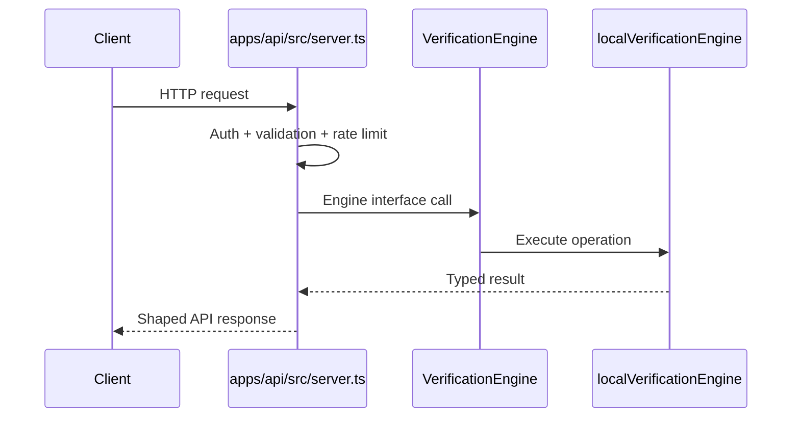

**Navigation**

- [Home](Home)
- [What is TrustSignal](What-is-TrustSignal)
- [Architecture](Evidence-Integrity-Architecture)
- [Verification Receipts](Verification-Receipts)
- [API Overview](API-Overview)
- [Claims Boundary](Claims-Boundary)
- [Quick Verification Example](Quick-Verification-Example)
- [Vanta Integration Example](Vanta-Integration-Example)

# API Overview

TrustSignal currently exposes two API surfaces in this repository.

## API Families

### Integration-Facing API

The `/api/v1/*` surface is the main partner-facing integration API in this repository. It uses `x-api-key` authentication with scoped access such as `verify`, `read`, `anchor`, and `revoke`.

### Legacy JWT API

The `/v1/*` surface is still present and is the surface used by the current JavaScript SDK. It uses bearer JWT authentication.

## Request Path From the Codebase

For the integration-facing API, the dominant request pattern is:

## `/api/v1/*` Endpoints

| Method | Path | Auth | Purpose |
| --- | --- | --- | --- |
| `GET` | `/api/v1/health` | none | Basic service and database readiness snapshot |
| `GET` | `/api/v1/status` | none | Service status, environment, ingress, and database posture |
| `GET` | `/api/v1/metrics` | none | Prometheus-compatible metrics |
| `GET` | `/api/v1/integrations/vanta/schema` | `x-api-key` with `read` | Return the Vanta evidence schema |
| `GET` | `/api/v1/integrations/vanta/verification/:receiptId` | `x-api-key` with `read` | Return a normalized Vanta evidence payload |
| `GET` | `/api/v1/registry/sources` | `x-api-key` with `read` | List configured registry sources |
| `POST` | `/api/v1/registry/verify` | `x-api-key` with `verify` | Run a single registry verification request |
| `POST` | `/api/v1/registry/verify-batch` | `x-api-key` with `verify` | Run a batch registry verification request |
| `GET` | `/api/v1/registry/jobs` | `x-api-key` with `read` | List registry job records |
| `GET` | `/api/v1/registry/jobs/:jobId` | `x-api-key` with `read` | Retrieve one registry job record |
| `POST` | `/api/v1/verify/attom` | `x-api-key` with `verify` | Run the Cook County ATTOM cross-check |
| `POST` | `/api/v1/verify` | `x-api-key` with `verify` | Create a verification receipt |
| `GET` | `/api/v1/synthetic` | `x-api-key` with `read` | Return a synthetic bundle for testing |
| `GET` | `/api/v1/receipt/:receiptId` | `x-api-key` with `read` | Retrieve a stored receipt |
| `GET` | `/api/v1/receipt/:receiptId/pdf` | `x-api-key` with `read` | Download a PDF receipt |
| `POST` | `/api/v1/receipt/:receiptId/verify` | `x-api-key` with `read` | Verify receipt integrity and status |
| `POST` | `/api/v1/anchor/:receiptId` | `x-api-key` with `anchor` | Trigger receipt anchoring when allowed |
| `POST` | `/api/v1/receipt/:receiptId/revoke` | `x-api-key` with `revoke` | Revoke a receipt with issuer authorization |
| `GET` | `/api/v1/receipts` | `x-api-key` with `read` | List recent receipts |

`POST /api/v1/receipt/:receiptId/revoke` also requires these signed issuer headers:

- `x-issuer-id`
- `x-signature-timestamp`
- `x-issuer-signature`

## Gateway to Engine Mapping

These route handlers currently delegate through the engine interface:

| Method | Path | Gateway Action | Engine Call |
| --- | --- | --- | --- |
| `GET` | `/api/v1/integrations/vanta/verification/:receiptId` | parse `receiptId`, validate auth, shape schema response | `getVantaVerificationResult` |
| `GET` | `/api/v1/registry/sources` | validate auth | `listRegistrySources` |
| `POST` | `/api/v1/registry/verify` | validate body, auth, and source id | `verifyRegistrySource` |
| `POST` | `/api/v1/registry/verify-batch` | validate body, auth, and source ids | `verifyRegistrySources` |
| `GET` | `/api/v1/registry/jobs` | parse limit, validate auth | `listRegistryOracleJobs` |
| `GET` | `/api/v1/registry/jobs/:jobId` | validate auth and route param | `getRegistryOracleJob` |
| `POST` | `/api/v1/verify/attom` | validate deed payload and county guard | `crossCheckAttom` |
| `POST` | `/api/v1/verify` | validate verification payload and map response | `createVerification` |
| `GET` | `/api/v1/synthetic` | validate auth | `createSyntheticBundle` |
| `GET` | `/api/v1/receipt/:receiptId` | parse `receiptId` and map response | `getReceipt` |
| `GET` | `/api/v1/receipt/:receiptId/pdf` | parse `receiptId`, then render PDF from stored receipt | `getReceipt` |
| `POST` | `/api/v1/receipt/:receiptId/verify` | reject body, parse `receiptId` | `getVerificationStatus` |
| `POST` | `/api/v1/anchor/:receiptId` | reject body, parse `receiptId` | `anchorReceipt` |
| `POST` | `/api/v1/receipt/:receiptId/revoke` | reject body, parse `receiptId`, verify issuer headers | `revokeReceipt` |

Gateway-owned routes that do not call the engine interface directly:

| Method | Path | Notes |
| --- | --- | --- |
| `GET` | `/api/v1/health` | service health and database readiness |
| `GET` | `/api/v1/status` | service status and deployment posture snapshot |
| `GET` | `/api/v1/metrics` | Prometheus metrics |
| `GET` | `/api/v1/integrations/vanta/schema` | static schema response |
| `GET` | `/api/v1/receipts` | recent receipt listing view |

## `/v1/*` Endpoints

| Method | Path | Auth | Purpose |
| --- | --- | --- | --- |
| `POST` | `/v1/verify-bundle` | bearer JWT | Verify a bundle and return the combined result |
| `POST` | `/v1/revoke` | bearer JWT with admin authorization | Revoke a bundle |
| `GET` | `/v1/status/:bundleId` | bearer JWT | Check bundle status |

## Legacy `/v1/*` Route Behavior

The `/v1/*` handlers are still present in `src/routes/` and currently use older route dependencies rather than the `apps/api` engine interface.

| Method | Path | Current Handler Flow |
| --- | --- | --- |
| `POST` | `/v1/verify-bundle` | validate body -> `deps.verifyBundle(...)` -> `recordStore.create(...)` |
| `GET` | `/v1/status/:bundleId` | validate param -> `recordStore.findByBundleHash(...)` |
| `POST` | `/v1/revoke` | validate body and admin claim -> `recordStore.findByBundleHash(...)` -> `anchorNullifier(...)` -> `recordStore.revokeByBundleHash(...)` |

## Error Semantics

Integrators should expect these broad response patterns:

- `400` for schema or request-shape errors
- `401` or `403` for missing credentials, invalid credentials, or missing scope
- `404` for unknown receipts or jobs
- `409` for lifecycle conflicts such as missing preconditions
- `429` for rate limits
- `502` for upstream dependency failures
- `503` when the service is up but a required database path is unavailable

## Integration Notes

- Use `/api/v1/*` for receipt-oriented integrations and partner workflows.
- Use `/v1/*` only if you are integrating with the current SDK or an existing JWT-based bundle flow.
- Treat the response payload as the source of technical verification status. Do not infer state from transport success alone.
- The `/api/v1/*` surface is the one that currently matches the public gateway and private engine boundary described elsewhere in this wiki.
- For a concrete payload and response example, see [Quick Verification Example](Quick-Verification-Example).
