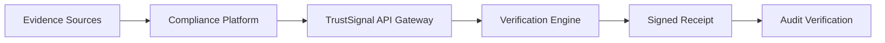
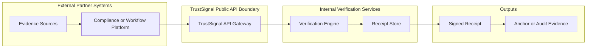
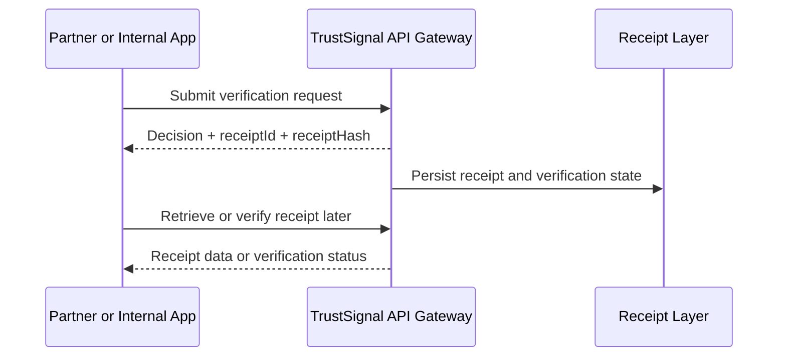
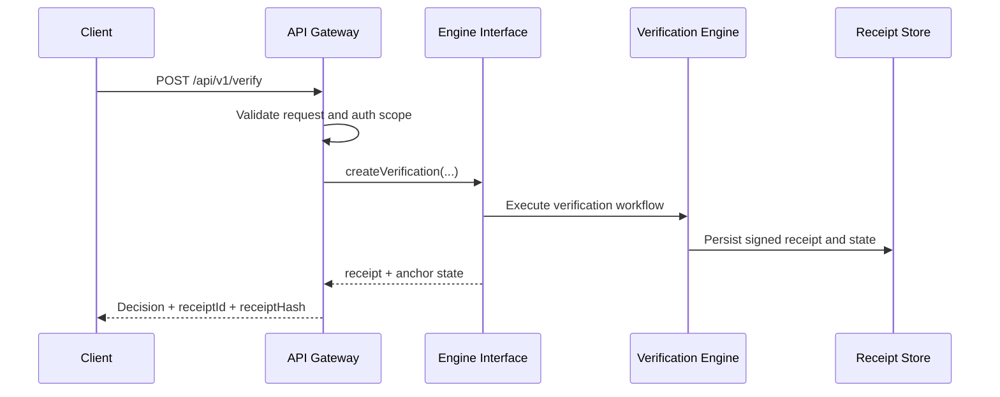

**Navigation**

- [Home](Home.md)
- [What is TrustSignal](What-is-TrustSignal.md)
- [Architecture](Evidence-Integrity-Architecture.md)
- [Verification Receipts](Verification-Receipts.md)
- [API Overview](API-Overview.md)
- [Claims Boundary](Claims-Boundary.md)
- [Quick Verification Example](Quick-Verification-Example.md)
- [Vanta Integration Example](Vanta-Integration-Example.md)

# Evidence Integrity Architecture

TrustSignal is designed as a bounded verification layer between evidence-producing systems and downstream audit or compliance consumers.

## Product-Level Architecture

## Public Trust Boundary

This reflects the current public request path implemented in `apps/api/src/server.ts`: the gateway validates and authorizes the request, then delegates major verification lifecycle actions to the engine interface under `apps/api/src/engine/`.

## Integration Model

## Verification Lifecycle Flow

## Boundary Responsibilities

The public integration boundary is responsible for:

- authentication and authorization
- request validation
- scoped access control
- rate limiting
- response shaping
- versioned API behavior

TrustSignal then returns a receipt-oriented result that downstream systems can store or forward.

The verification engine behind the gateway is intentionally internal. Integrators should depend on the API contract and receipt model rather than internal implementation details.

## Current Route Boundary

In the current codebase:

- the `/api/v1/*` surface follows the gateway-to-engine pattern for major lifecycle actions
- the engine interface currently exposes methods such as `createVerification`, `getReceipt`, `getVerificationStatus`, `getVantaVerificationResult`, `crossCheckAttom`, `anchorReceipt`, and `revokeReceipt`
- the legacy `/v1/*` JWT surface still uses older route dependencies and should be treated as a separate compatibility surface

## Data Handling Model

TrustSignal is intended to retain verification artifacts in the form of receipts and related metadata rather than act as a long-term workflow database. Integrators should treat the upstream platform as the operational system of record and TrustSignal as the source of integrity evidence for the verification event.

## Why This Matters

Many systems can show that a document was reviewed. Fewer can later show that the result being referenced still corresponds to the same evaluated artifact. TrustSignal closes that gap by turning a verification event into a signed, retrievable artifact with lifecycle state.
