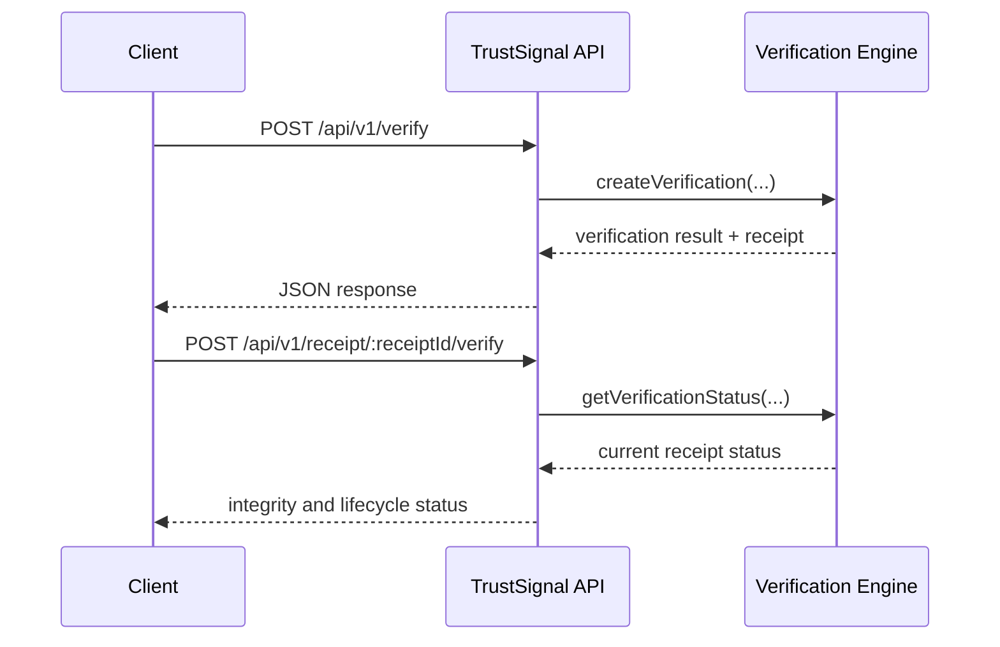

**Navigation**

- [Home](Home)
- [What is TrustSignal](What-is-TrustSignal)
- [Architecture](Evidence-Integrity-Architecture)
- [Verification Receipts](Verification-Receipts)
- [API Overview](API-Overview)
- [Claims Boundary](Claims-Boundary)
- [Quick Verification Example](Quick-Verification-Example)
- [Vanta Integration Example](Vanta-Integration-Example)

# Quick Verification Example

This page is written for developers, integration engineers, compliance engineers, and technical partner reviewers who want to understand the smallest realistic TrustSignal verification flow.

## What This Example Demonstrates

This example shows how to:

- submit a verification request to the public TrustSignal API
- receive a decision plus a signed receipt
- inspect the main receipt fields returned by the API
- understand how later re-verification works

The example uses the current integration-facing receipt workflow on `POST /api/v1/verify`.

## Verification Lifecycle



## Product Terms and Current API Fields

The public product language often maps to the current API contract like this:

| Product Term | Current API Field |
| --- | --- |
| `artifact_hash` | `doc.docHash` |
| `source` | caller-owned workflow or integration context |
| `timestamp` | `timestamp` |
| `control_id` | `policy.profile` |
| `verification_id` | `bundleId` |
| `receipt_id` | `receiptId` |
| `receipt_signature` | `receiptSignature` |
| `status` | `decision` and later verification status |
| `anchor_subject_digest` | `anchor.subjectDigest` |

## Example Request

```bash
curl -X POST https://api.trustsignal.example/api/v1/verify \
  -H "Content-Type: application/json" \
  -H "x-api-key: $TRUSTSIGNAL_API_KEY" \
  -d '{
    "bundleId": "verification-2026-04-18-001",
    "transactionType": "compliance_evidence",
    "ron": {
      "provider": "source-system",
      "notaryId": "NOTARY-EXAMPLE-01",
      "commissionState": "IL",
      "sealPayload": "example-seal-payload"
    },
    "doc": {
      "docHash": "0x8b7b2f52f2a2e19f8f3fe0d815d1c1d8d1e0d120e8cc60d1baf5e7a6f9d211aa"
    },
    "property": {
      "parcelId": "PARCEL-EXAMPLE-1001",
      "county": "Cook",
      "state": "IL"
    },
    "policy": {
      "profile": "CONTROL_CC_001"
    },
    "timestamp": "2026-04-18T15:24:00.000Z"
  }'
```

This example uses:

- `bundleId` as the caller-controlled verification identifier
- `doc.docHash` as the artifact hash
- `policy.profile` as the control or policy context

## Example Response

```json
{
  "receiptVersion": "2.0",
  "decision": "ALLOW",
  "reasons": [],
  "receiptId": "2c17d2f5-4de6-48c3-b22c-0b7ea9eb5c0a",
  "receiptHash": "0x4e7f2ce9d3f7a8d3b0e4c9f2aa17fd59d6b4fda2d7b7b7d1cce8124d7ee39d04",
  "receiptSignature": {
    "alg": "EdDSA",
    "kid": "trustsignal-current",
    "signature": "eyJleGFtcGxlIjoic2lnbmVkLXJlY2VpcHQifQ"
  },
  "anchor": {
    "status": "PENDING",
    "subjectDigest": "0x8c0f95cda31274e7b61adfd1dd1e0c03a4b96f78d90da52d42fd93d9a38fc112"
  },
  "revocation": {
    "status": "ACTIVE"
  }
}
```

## Key Response Fields

- `receiptId`: the durable receipt handle for later retrieval and verification
- `receiptHash`: the integrity digest for the returned receipt payload
- `receiptSignature`: the presence of a signed receipt artifact, without exposing signing infrastructure details
- `anchor.subjectDigest`: the public-facing anchor subject digest when available
- `decision`: the current verification outcome returned by the public API
- `revocation.status`: whether the receipt is currently active or revoked

## Later Re-Verification

To check the receipt later, call:

- `GET /api/v1/receipt/:receiptId` to retrieve the stored receipt
- `POST /api/v1/receipt/:receiptId/verify` to validate current receipt integrity and status

Example:

```bash
curl -X POST https://api.trustsignal.example/api/v1/receipt/2c17d2f5-4de6-48c3-b22c-0b7ea9eb5c0a/verify \
  -H "x-api-key: $TRUSTSIGNAL_API_KEY"
```

That later check is how downstream systems confirm that the receipt still matches stored verification state rather than relying only on the original response.

## What This Does Not Expose

This example intentionally does not expose:

- proof witness details
- scoring internals
- circuit identifiers
- model outputs
- signing infrastructure specifics
- internal service topology

The public integration contract is the request, the response, and the receipt lifecycle behavior.

## Production Readiness

For production integrations, treat the request/response example as the contract and operationalize these controls:

- authentication and API keys with scoped access per workflow
- environment configuration for required service dependencies and secure configuration loading
- receipt lifecycle monitoring for new, verified, revoked, and anchored states
- verification checks before relying on earlier results in audit or partner handoff workflows
