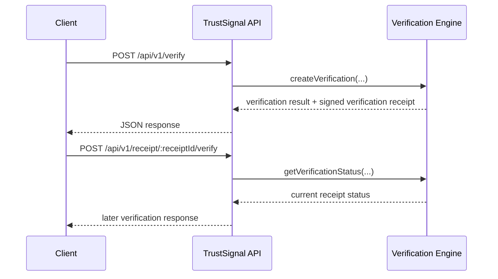

**Navigation**

- [Home](Home)
- [What is TrustSignal](What-is-TrustSignal)
- [Architecture](Evidence-Integrity-Architecture)
- [Verification Receipts](Verification-Receipts)
- [API Overview](API-Overview)
- [Claims Boundary](Claims-Boundary)
- [Quick Verification Example](Quick-Verification-Example)
- [Vanta Integration Example](Vanta-Integration-Example)

# Quick Verification Example

## Problem

This example is for partner engineers who want the smallest realistic TrustSignal flow that shows what goes in, what comes back, and how later verification works.

## Integrity Model

The example uses the current integration-facing lifecycle to create a verification, return verification signals plus a signed verification receipt, and later verify stored receipt state.

## Integration Fit

Start here for the full evaluator path:

- [Evaluator quickstart](/Users/christopher/Projects/trustsignal/docs/partner-eval/quickstart.md)
- [API playground](/Users/christopher/Projects/trustsignal/docs/partner-eval/api-playground.md)
- [OpenAPI contract](/Users/christopher/Projects/trustsignal/openapi.yaml)
- [Postman collection](/Users/christopher/Projects/trustsignal/postman/TrustSignal.postman_collection.json)



## Technical Detail

### Product Terms And Current API Fields

| Product Term | Current API Field |
| --- | --- |
| `artifact_hash` | `doc.docHash` |
| `timestamp` | `timestamp` |
| `control_id` | `policy.profile` |
| `verification_id` | `bundleId` |
| `receipt_id` | `receiptId` |
| `receipt_signature` | `receiptSignature` |
| `status` | `decision` and later verification status |
| `anchor_subject_digest` | `anchor.subjectDigest` |

### Example Request

```bash
curl -X POST https://api.trustsignal.example/api/v1/verify \
  -H "Content-Type: application/json" \
  -H "x-api-key: $TRUSTSIGNAL_API_KEY" \
  -d @examples/verification-request.json
```

### Example Response

```json
{
  "receiptVersion": "2.0",
  "decision": "ALLOW",
  "reasons": ["receipt issued"],
  "receiptId": "2c17d2f5-4de6-48c3-b22c-0b7ea9eb5c0a",
  "receiptHash": "0x4e7f2ce9d3f7a8d3b0e4c9f2aa17fd59d6b4fda2d7b7b7d1cce8124d7ee39d04",
  "receiptSignature": {
    "alg": "EdDSA",
    "kid": "trustsignal-current",
    "signature": "eyJleGFtcGxlIjoic2lnbmVkLXJlY2VpcHQifQ"
  },
  "anchor": {
    "status": "PENDING",
    "subjectDigest": "0x8c0f95cda31274e7b61adfd1dd1e0c03a4b96f78d90da52d42fd93d9a38fc112",
    "subjectVersion": "trustsignal.anchor_subject.v1"
  },
  "revocation": {
    "status": "ACTIVE"
  }
}
```

### Later Verification

To retrieve the stored receipt:

```bash
curl -H "x-api-key: $TRUSTSIGNAL_API_KEY" \
  https://api.trustsignal.example/api/v1/receipt/2c17d2f5-4de6-48c3-b22c-0b7ea9eb5c0a
```

To run later verification:

```bash
curl -X POST -H "x-api-key: $TRUSTSIGNAL_API_KEY" \
  https://api.trustsignal.example/api/v1/receipt/2c17d2f5-4de6-48c3-b22c-0b7ea9eb5c0a/verify
```

### What This Does Not Expose

This public example does not expose:

- proof internals
- circuit identifiers
- model outputs
- signing infrastructure specifics
- internal service topology
- witness or prover details
- registry scoring algorithms
