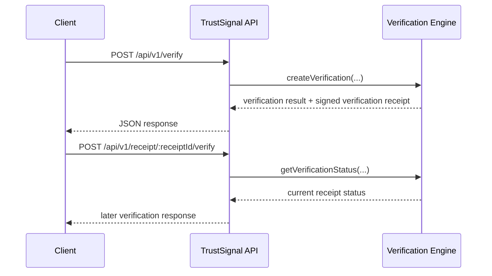

**Navigation**

- [Home](Home.md)
- [What is TrustSignal](What-is-TrustSignal.md)
- [Architecture](Evidence-Integrity-Architecture.md)
- [Verification Receipts](Verification-Receipts.md)
- [API Overview](API-Overview.md)
- [Claims Boundary](Claims-Boundary.md)
- [Quick Verification Example](Quick-Verification-Example.md)
- [Vanta Integration Example](Vanta-Integration-Example.md)

# Quick Verification Example

Short description:
This page walks through a minimal TrustSignal evaluator flow for verification signals, signed verification receipts, verifiable provenance, and later verification.

Audience:
- partner evaluators
- integration engineers
- developers

## Problem / Context

This example is for partner engineers who want the smallest realistic TrustSignal flow that shows what goes in, what comes back, and how later verification works. It is intended for workflows where tampered evidence, provenance loss, artifact substitution, and stale evidence matter after collection.

## Integrity Model

The canonical lifecycle diagram is documented in [docs/verification-lifecycle.md](/Users/christopher/Projects/trustsignal/docs/verification-lifecycle.md).

This example uses the current integration-facing lifecycle to create a verification, return verification signals plus a signed verification receipt, store the receipt with the workflow record, and later verify stored receipt state during audit review.

## How It Works

This example shows:

- signed verification receipts
- verification signals
- verifiable provenance
- later verification
- existing workflow integration through the public lifecycle

## Demo

Start here for the full evaluator path:

- [Evaluator quickstart](/Users/christopher/Projects/trustsignal/docs/partner-eval/quickstart.md)
- [API playground](/Users/christopher/Projects/trustsignal/docs/partner-eval/api-playground.md)
- [OpenAPI contract](/Users/christopher/Projects/trustsignal/openapi.yaml)
- [Postman collection](/Users/christopher/Projects/trustsignal/postman/TrustSignal.postman_collection.json)

## API And Examples

This example is a deliberate evaluator path. It is designed to show the verification lifecycle before production authentication, signing, and environment requirements are fully configured.

## Production Considerations

> [!IMPORTANT]
> Production considerations: this is a compact evaluator example. Production deployment still requires explicit authentication, signing configuration, infrastructure controls, and operational review.

## Production Deployment Requirements

Local development defaults are intentionally constrained and fail closed where production trust assumptions are not satisfied. Production deployment requires explicit authentication, signing configuration, and environment setup.

## Example Or Diagram



### Product Terms And Current API Fields

| Product Term | Current API Field |
| --- | --- |
| `artifact_hash` | `doc.docHash` |
| `timestamp` | `timestamp` |
| `control_id` | `policy.profile` |
| `verification_id` | `bundleId` |
| `receipt_id` | `receiptId` |
| `receipt_signature` | `receiptSignature` |
| `status` | `decision` and later verification status |
| `anchor_subject_digest` | `anchor.subjectDigest` |

### Example Request

```bash
curl -X POST https://api.trustsignal.example/api/v1/verify \
  -H "Content-Type: application/json" \
  -H "x-api-key: $TRUSTSIGNAL_API_KEY" \
  -d @examples/verification-request.json
```

### Example Response

```json
{
  "receiptVersion": "2.0",
  "decision": "ALLOW",
  "reasons": ["receipt issued"],
  "receiptId": "2c17d2f5-4de6-48c3-b22c-0b7ea9eb5c0a",
  "receiptHash": "0x4e7f2ce9d3f7a8d3b0e4c9f2aa17fd59d6b4fda2d7b7b7d1cce8124d7ee39d04",
  "receiptSignature": {
    "alg": "EdDSA",
    "kid": "trustsignal-current",
    "signature": "eyJleGFtcGxlIjoic2lnbmVkLXJlY2VpcHQifQ"
  },
  "anchor": {
    "status": "PENDING",
    "subjectDigest": "0x8c0f95cda31274e7b61adfd1dd1e0c03a4b96f78d90da52d42fd93d9a38fc112",
    "subjectVersion": "trustsignal.anchor_subject.v1"
  },
  "revocation": {
    "status": "ACTIVE"
  }
}
```

### Later Verification

To retrieve the stored receipt:

```bash
curl -H "x-api-key: $TRUSTSIGNAL_API_KEY" \
  https://api.trustsignal.example/api/v1/receipt/2c17d2f5-4de6-48c3-b22c-0b7ea9eb5c0a
```

To run later verification:

```bash
curl -X POST -H "x-api-key: $TRUSTSIGNAL_API_KEY" \
  https://api.trustsignal.example/api/v1/receipt/2c17d2f5-4de6-48c3-b22c-0b7ea9eb5c0a/verify
```

### Recent Verification Timing

Recent local benchmark snapshot from [bench/results/latest.md](/Users/christopher/Projects/trustsignal/bench/results/latest.md) at `2026-03-12T22:30:04.260Z`:

- clean verification request latency: mean `5.24 ms`, median `4.11 ms`, p95 `21.65 ms`
- signed receipt generation latency: mean `0.34 ms`, median `0.32 ms`, p95 `0.63 ms`
- receipt lookup latency: mean `0.57 ms`, median `0.56 ms`, p95 `0.63 ms`
- later verification latency: mean `0.77 ms`, median `0.71 ms`, p95 `1.08 ms`
- tampered artifact detection latency: mean `7.76 ms`, median `5.13 ms`, p95 `42.82 ms`

This is a recent local evaluator benchmark snapshot, not a production guarantee. The tampered path is most useful as a behavior check for mismatch handling rather than a parser-completeness claim.

## Security And Claims Boundary

> [!NOTE]
> Claims boundary: this example documents the public evaluation flow only. It does not expose proof internals, circuit identifiers, model outputs, signing infrastructure specifics, or internal service topology.

### What This Does Not Expose

This public example does not expose:

- proof internals
- circuit identifiers
- model outputs
- signing infrastructure specifics
- internal service topology
- witness or prover details
- registry scoring algorithms

## Related Documentation

- [docs/partner-eval/try-the-api.md](/Users/christopher/Projects/trustsignal/docs/partner-eval/try-the-api.md)
- [docs/partner-eval/benchmark-summary.md](/Users/christopher/Projects/trustsignal/docs/partner-eval/benchmark-summary.md)
- [docs/verification-lifecycle.md](/Users/christopher/Projects/trustsignal/docs/verification-lifecycle.md)
- [wiki/Claims-Boundary.md](/Users/christopher/Projects/trustsignal/wiki/Claims-Boundary.md)
