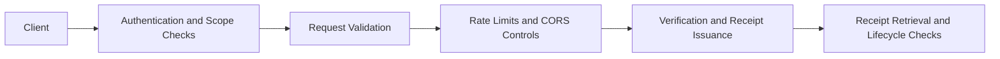

**Navigation**

- [Home](Home)
- [What is TrustSignal](What-is-TrustSignal)
- [Architecture](Evidence-Integrity-Architecture)
- [Verification Receipts](Verification-Receipts)
- [API Overview](API-Overview)
- [Claims Boundary](Claims-Boundary)
- [Quick Verification Example](Quick-Verification-Example)
- [Vanta Integration Example](Vanta-Integration-Example)

# Security Model

TrustSignal is documented with a security-first posture, but security claims are intentionally bounded. This page summarizes the external-facing controls that are implemented in the repository and the boundaries on what should be claimed publicly.

See also: [Threat Model](Threat-Model)

## Control Layers

## Implemented Controls

- JWT authentication on `/v1/*`
- scoped `x-api-key` authorization on `/api/v1/*`
- request validation at API boundaries
- rate limiting for both global and per-key traffic
- CORS allowlist behavior
- bounded error responses and response shaping
- receipt signing with verification-key support
- production startup guardrails for required configuration
- fail-closed behavior on critical verification paths
- log redaction for sensitive request material
- explicit revocation authorization checks for receipt revocation

## Data and Privacy Boundaries

- TrustSignal should not log raw PII unnecessarily.
- Raw sensitive content should not be anchored unless explicitly required and controlled.
- Sensitive transport paths are expected to use TLS in deployed environments.
- Downstream systems should store only the fields they actually need for audit or workflow purposes.

## Authentication Summary

| Surface | Auth Model |
| --- | --- |
| `/api/v1/*` | `x-api-key` plus scoped access control |
| `/v1/*` | bearer JWT |
| receipt revocation | `x-api-key` with `revoke` plus issuer signature headers |

## Operational Claims Boundary

External documentation should not imply:

- completed compliance certification without independent evidence
- environment-level encryption or key-custody guarantees without deployment evidence
- legal or policy determinations from TrustSignal outputs alone

## What This Documentation Intentionally Omits

This page does not document:

- private proof implementation details
- internal scoring logic
- signing key infrastructure details
- internal service deployment topology

Those details are intentionally separated from the public integration model.

## Related Documentation

- [Threat Model](Threat-Model)
- [Evidence Integrity Architecture](Evidence-Integrity-Architecture)
