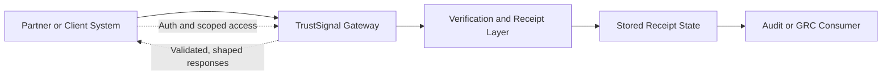
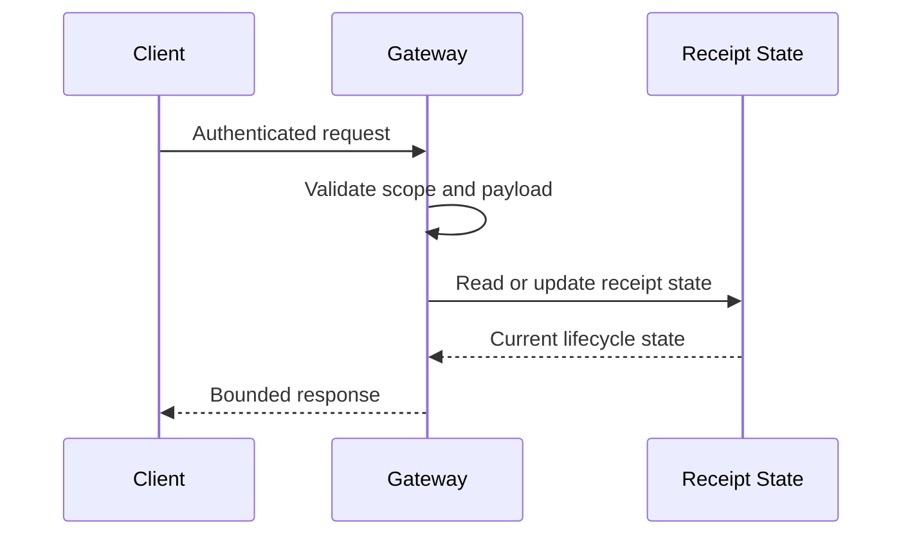

**Navigation**

- [Home](Home.md)
- [What is TrustSignal](What-is-TrustSignal.md)
- [Architecture](Evidence-Integrity-Architecture.md)
- [Verification Receipts](Verification-Receipts.md)
- [API Overview](API-Overview.md)
- [Claims Boundary](Claims-Boundary.md)
- [Quick Verification Example](Quick-Verification-Example.md)
- [Vanta Integration Example](Vanta-Integration-Example.md)

# Threat Model

Related pages: [Security Model](Security-Model.md) · [Evidence Integrity Architecture](Evidence-Integrity-Architecture.md)

This page summarizes the external threat model for TrustSignal at the public integration boundary. It is intended for developers, security reviewers, and integration partners evaluating how TrustSignal handles verification requests, receipt lifecycle operations, and downstream evidence use.

The scope of this page is the public-facing product contract. It does not document proprietary verification engine implementation details.

## Scope

In scope:

- the `/api/v1/*` integration surface
- the `/v1/*` JWT surface
- receipt retrieval, verification, revocation, and anchoring flows
- authentication, authorization, validation, rate limiting, and response behavior
- trust boundaries between client systems, the gateway, stored receipt state, and downstream evidence consumers

Out of scope:

- private verification engine implementation details
- proof internals
- scoring logic
- model details
- internal deployment topology

## Trust Boundaries

## Protected Assets

- verification receipts and their lifecycle state
- receipt identifiers and hashes used in downstream audit processes
- authorization context for verification, anchoring, and revocation operations
- audit-facing evidence payloads such as the Vanta integration result
- sensitive request content and metadata handled at the API boundary

## Security Objectives

- prevent unauthorized access to verification and receipt lifecycle routes
- prevent unauthorized revocation or anchoring actions
- reduce the risk of tampered, stale, or misleading receipt use
- minimize exposure of sensitive request data
- ensure dependency failures are surfaced safely and do not silently downgrade trust

## Threat Areas

| Threat Area | Example Risk | Public-Surface Mitigations |
| --- | --- | --- |
| Authentication bypass | Unauthenticated caller reaches protected endpoints | JWT checks on `/v1/*`; scoped `x-api-key` enforcement on `/api/v1/*` |
| Authorization misuse | Caller uses the wrong scope for read, verify, anchor, or revoke actions | Scope checks at the gateway before handler execution |
| Request tampering | Invalid or malformed payloads drive unintended behavior | Schema validation and route-level request guards |
| Receipt misuse | Consumer relies on an outdated or revoked receipt | Receipt verification and lifecycle endpoints expose current state |
| Unauthorized revocation | Caller attempts to revoke a receipt without issuer authority | Revocation requires both API authorization and signed issuer headers |
| Dependency failure masking | Upstream or dependency failures look like successful verification | Explicit error handling and fail-closed behavior on critical paths |
| Abuse or enumeration | Repeated calls attempt discovery or service exhaustion | Global and per-key rate limiting, bounded error responses |
| Sensitive data exposure | Request data or evidence content leaks via logs or responses | Redaction, response shaping, and data minimization guidance |

## Request Lifecycle Risks

Key lifecycle risks include:

- creating a receipt from an invalid or malformed request
- retrieving a receipt without the required access scope
- acting on a revoked or missing receipt
- treating a transport success as equivalent to a valid verification outcome

## Threat Notes by Route Family

### Verification routes

Relevant routes:

- `POST /api/v1/verify`
- `POST /api/v1/verify/attom`
- `POST /v1/verify-bundle`

Primary concerns:

- malformed or oversized requests
- unauthorized verification attempts
- unsafe handling of upstream dependency failures

### Receipt lifecycle routes

Relevant routes:

- `GET /api/v1/receipt/:receiptId`
- `GET /api/v1/receipt/:receiptId/pdf`
- `POST /api/v1/receipt/:receiptId/verify`
- `POST /api/v1/receipt/:receiptId/revoke`
- `POST /api/v1/anchor/:receiptId`

Primary concerns:

- receipt identifier enumeration
- unauthorized lifecycle changes
- use of stale lifecycle state by downstream systems

### Evidence export routes

Relevant routes:

- `GET /api/v1/integrations/vanta/schema`
- `GET /api/v1/integrations/vanta/verification/:receiptId`

Primary concerns:

- exporting evidence for the wrong receipt
- overexposing sensitive information in downstream payloads
- confusing technical verification outputs with legal or compliance determinations

## Reviewer Guidance

Security reviewers should focus on:

- auth and scope enforcement at the route boundary
- bounded and non-sensitive error behavior
- revocation authorization requirements
- receipt lifecycle correctness
- evidence payload minimization
- separation between public gateway code and private verification logic

## Claims Boundary

This threat model describes the public product boundary and current code-level controls. It should not be used to claim:

- a complete certification outcome
- infrastructure guarantees without environment-specific evidence
- formal assurance of private engine behavior that is not documented here
