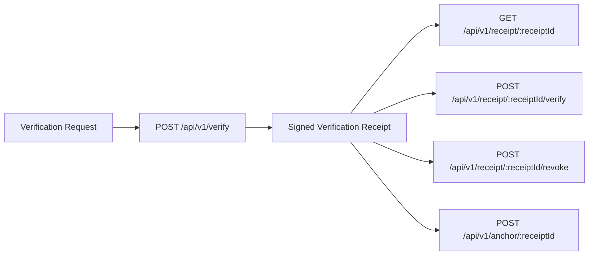

**Navigation**

- [Home](Home)
- [What is TrustSignal](What-is-TrustSignal)
- [Architecture](Evidence-Integrity-Architecture)
- [Verification Receipts](Verification-Receipts)
- [API Overview](API-Overview)
- [Claims Boundary](Claims-Boundary)
- [Quick Verification Example](Quick-Verification-Example)
- [Vanta Integration Example](Vanta-Integration-Example)

# Verification Receipts

## Problem

A workflow record alone is often not enough when a team needs to verify later what artifact was evaluated and what result was returned.

## Integrity Model

A TrustSignal verification receipt is the durable output of a verification event. It provides a stable identifier, a signed verification artifact, verification signals, and lifecycle state that downstream systems can use for audit-ready evidence and later verification.

## Integration Fit

## Technical Detail

### Core Receipt Concepts

| Field | Purpose |
| --- | --- |
| `receiptId` | Stable identifier for retrieval and lifecycle operations |
| `receiptHash` | Canonical digest of the unsigned receipt payload |
| `inputsCommitment` | Digest representing the verification input bundle |
| `decision` | High-level verification signal such as `ALLOW`, `FLAG`, or `BLOCK` |
| `checks` | Individual check results included in the receipt payload |
| `reasons` | Human-readable reasons associated with the decision |
| `receiptSignature` | Signed verification receipt material returned by the API |
| `revocation.status` | Whether the receipt is active or revoked |
| `anchor.subjectDigest` | Verifiable provenance digest used for later verification |

### Typical Operations

- Create a receipt with `POST /api/v1/verify`
- Retrieve the stored receipt with `GET /api/v1/receipt/:receiptId`
- Download a PDF rendering with `GET /api/v1/receipt/:receiptId/pdf`
- Run later verification with `POST /api/v1/receipt/:receiptId/verify`
- Revoke a receipt when authorized with `POST /api/v1/receipt/:receiptId/revoke`
- Retrieve provenance state when enabled with `POST /api/v1/anchor/:receiptId`

### Claims Boundary

A receipt is a technical verification artifact. It is not a legal determination, compliance certification, fraud adjudication, or a replacement for the system of record.
