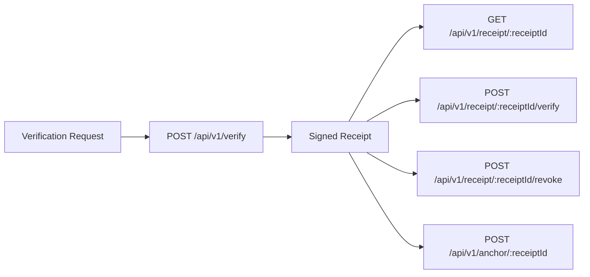
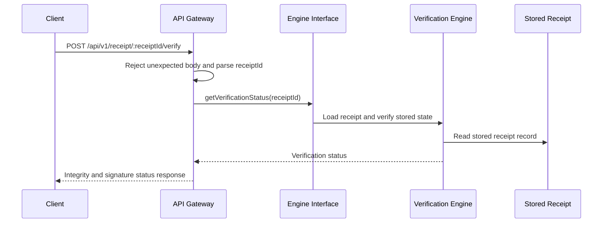

**Navigation**

- [Home](Home)
- [What is TrustSignal](What-is-TrustSignal)
- [Architecture](Evidence-Integrity-Architecture)
- [Verification Receipts](Verification-Receipts)
- [API Overview](API-Overview)
- [Claims Boundary](Claims-Boundary)
- [Quick Verification Example](Quick-Verification-Example)
- [Vanta Integration Example](Vanta-Integration-Example)

# Verification Receipts

A TrustSignal verification receipt is the durable output of a verification event. It provides a stable identifier, a signed payload, and lifecycle state that downstream systems can use as audit evidence.

## Receipt Lifecycle

## Receipt Verification Flow

## Core Receipt Concepts

| Field | Purpose |
| --- | --- |
| `receiptId` | Stable identifier for retrieval and lifecycle operations |
| `receiptHash` | Canonical digest of the unsigned receipt payload |
| `inputsCommitment` | Digest representing the verification input bundle |
| `decision` | High-level outcome such as `ALLOW`, `FLAG`, or `BLOCK` |
| `checks` | Individual check results included in the receipt payload |
| `reasons` | Human-readable reasons associated with the decision |
| `receiptSignature` | Signature metadata used to verify the receipt payload |
| `revocation.status` | Whether the receipt is still active |
| `anchor.status` | Whether anchoring has occurred for the receipt |

## Typical Operations

- Create a receipt with `POST /api/v1/verify`
- Retrieve the stored receipt with `GET /api/v1/receipt/:receiptId`
- Download a PDF rendering with `GET /api/v1/receipt/:receiptId/pdf`
- Re-check integrity and signature status with `POST /api/v1/receipt/:receiptId/verify`
- Revoke a receipt when authorized with `POST /api/v1/receipt/:receiptId/revoke`
- Trigger anchoring when enabled with `POST /api/v1/anchor/:receiptId`

For a concrete payload example, see [Quick Verification Example](Quick-Verification-Example).

## Route-Derived Receipt Paths

The receipt lifecycle implemented in `apps/api/src/server.ts` currently follows this pattern:

- `GET /api/v1/receipt/:receiptId` calls `getReceipt`
- `GET /api/v1/receipt/:receiptId/pdf` calls `getReceipt`, then renders PDF in the gateway
- `POST /api/v1/receipt/:receiptId/verify` calls `getVerificationStatus`
- `POST /api/v1/anchor/:receiptId` calls `anchorReceipt`
- `POST /api/v1/receipt/:receiptId/revoke` verifies issuer headers, then calls `revokeReceipt`

## Why Receipts Matter

The receipt is the bridge between a one-time verification event and later audit use. Instead of relying on screenshots, operator notes, or implicit state in another system, a downstream reviewer can work from a signed artifact with an explicit lifecycle.

## Practical Guidance

- Store the `receiptId` and `receiptHash` in the upstream workflow record.
- Treat the receipt as evidence of what TrustSignal evaluated at that point in time.
- Re-run receipt verification before audit submission or partner handoff when current status matters.

## Claims Boundary

A receipt is a technical verification artifact. It is not a legal determination, and it does not replace the underlying business process or system-of-record controls.
